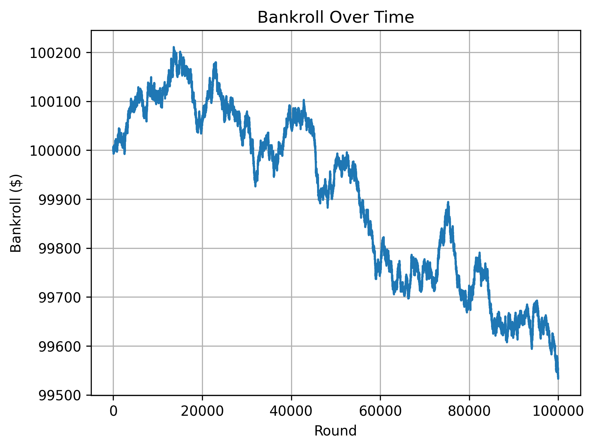
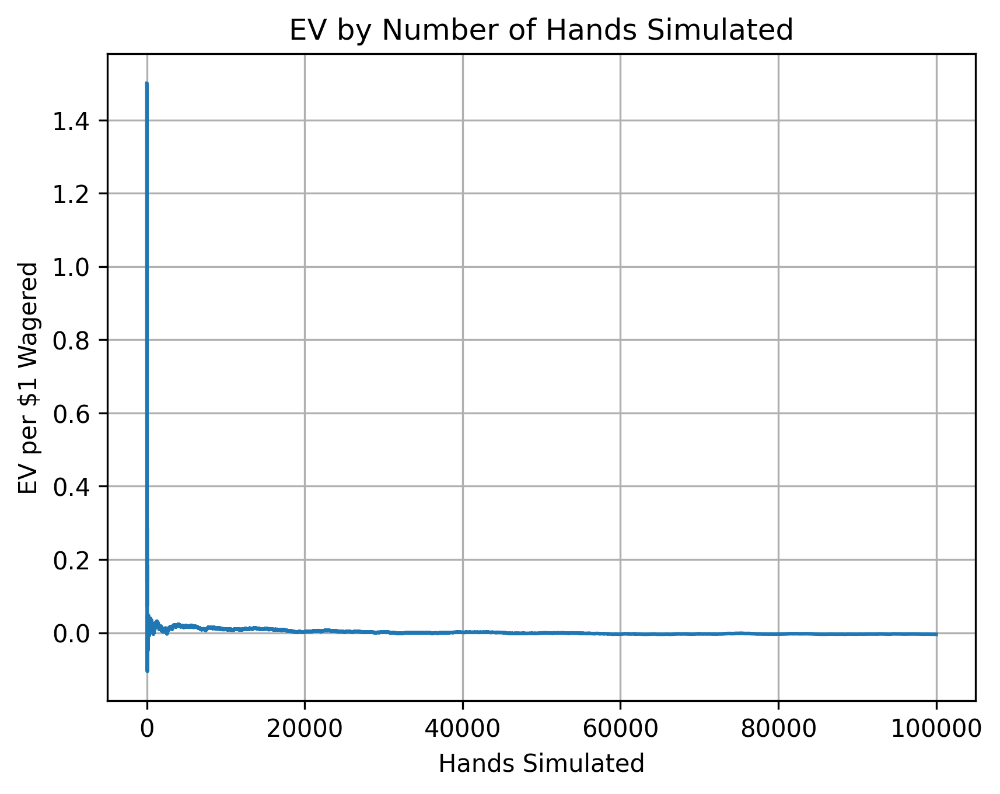
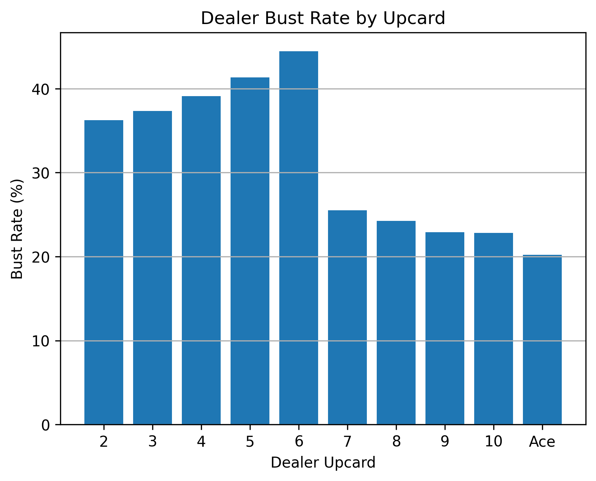
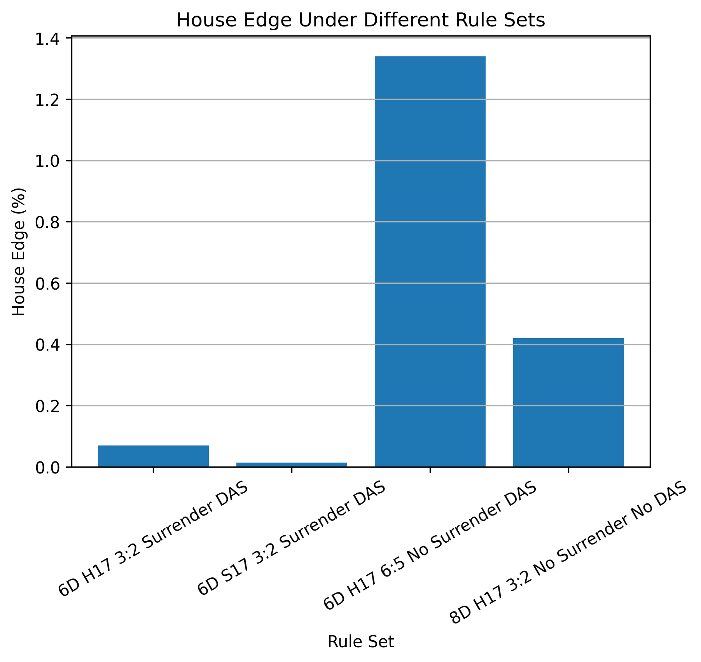

# Blackjack Monte Carlo Simulator

## Overview

This project is a Python blackjack simulator that uses Monte Carlo simulation to estimate blackjack outcomes, expected value, house edge, return percentage, bankroll movement, decision frequency, and rule-set differences.

The simulator supports configurable blackjack rules, basic strategy autoplay, optional Hi-Lo card counting, and graph generation using Matplotlib.

## Features

- Multi-deck shoe simulation
- Configurable number of decks
- Dealer hits or stands on soft 17
- 3:2 and 6:5 blackjack payout options
- Surrender option
- Double after split option
- Basic strategy autoplay
- Optional Hi-Lo card counting
- Bankroll tracking
- Expected value and RTP calculations
- Dealer bust rate by upcard
- Decision frequency tracking
- Rule-set house edge comparison
- Saved graph images

## Technologies Used

- Python
- Matplotlib
- Object-oriented programming
- Monte Carlo simulation
- Probability and expected value analysis

## Installation

Clone the repository:

```bash
git clone https://github.com/Ryan-5208/blackjack-monte-carlo-simulator.git
cd blackjack-monte-carlo-simulator
```

Install dependencies:

```bash
pip install -r requirements.txt
```

## Usage

Run the program:

```bash
python3 main.py
```

Then choose either game mode or simulation mode.

Game mode allows manual blackjack play. Simulation mode runs automated Monte Carlo simulations using basic strategy and optional card counting.

## Simulation Options

In simulation mode, the user can configure:

- Number of hands to simulate
- Starting bankroll
- Base bet size
- Card counting on/off
- Number of decks
- Whether the dealer hits soft 17
- Blackjack payout
- Whether surrender is allowed
- Whether double after split is allowed
- Which graphs to generate
- Whether to compare multiple rule sets

## Methodology

The simulator uses Monte Carlo simulation by repeatedly playing randomized blackjack hands under a chosen rule set. Over a large number of hands, the simulation estimates long-term performance metrics.

Key metrics include:

```text
Player Edge = Net Profit / Total Wagered
```

```text
House Edge = -Player Edge
```

```text
RTP = 100% + Player Edge
```

The simulator also tracks bankroll movement, resolved hands, win/loss/push rates, player busts, dealer busts, double downs, splits, surrenders, insurance decisions, and dealer bust rate by upcard.

## Project Structure

```text
blackjack-monte-carlo-simulator/
├── main.py             # User input and program control
├── game.py             # Blackjack gameplay logic
├── simulation.py       # Monte Carlo simulation runner
├── strategy.py         # Basic strategy and card-counting logic
├── stats.py            # Statistics tracking and output
├── graphs.py           # Matplotlib graph generation
├── cards.py            # Shoe creation, card display, and hand totals
├── settings.py         # Configurable blackjack rule settings
├── requirements.txt    # Python dependencies
├── graph_images/       # Saved graph outputs
└── README.md
```

## Example Output

Below is an example run from a 100,000-hand blackjack simulation using basic strategy.

```text
Choose mode: (G)ame or (S)imulation: S
How many hands should be simulated? 100000
Starting bankroll: $100000
Base bet amount: $1
Use card counting? (Y/N): n
Number of decks: 6
Dealer hits soft 17? (Y/N): y
Blackjack payout? Use 1.5 for 3:2, 1.2 for 6:5: 1.5
Allow surrender? (Y/N): y
Allow double after split? (Y/N): y

=== SIMULATION SETTINGS ===
Base bet: $1.00
Card counting: Off
Number of decks: 6
Dealer hits soft 17: Yes
Blackjack payout: 1.5:1
Surrender allowed: Yes
Double after split: Yes

=== SIMULATION RESULTS ===
Rounds played: 100000
Resolved player hands: 102610
Wins: 43584
Losses: 50701
Ties: 8325
Player Blackjacks: 4586
Dealer Blackjacks: 4480
Push on Blackjacks: 219
Player Busts: 12487
Dealer Busts: 23015
Net: $-462.00
Highest Net: $211.00
Lowest Net: $-467.00

=== BANKROLL STATS ===
Starting bankroll: $100000.00
Final bankroll: $99538.00
Highest bankroll: $100211.00
Lowest bankroll: $99533.00
Biggest bankroll drawdown: $678.00

=== EV / RETURN STATS ===
Win rate: 42.48%
Loss rate: 49.41%
Push rate: 8.11%
Average bet size: $1.13
EV per $1 wagered: $-0.0041
EV per hand: $-0.0046
Player edge: -0.4080%
House edge: 0.4080%
Return percentage / RTP: 99.5920%
Total wagered: $113248.00

=== DECISION STATS ===
Hits: 48678
Stands: 60846
Double downs: 10638
Splits: 2610
Surrenders: 5084
Insurance taken: 0
Insurance rate: 0.00%
Double-down rate: 10.64%
Split rate: 2.61%
Surrender rate: 5.08%

=== DEALER BUST RATE BY UPCARD WHEN DEALER PLAYS ===
2: 36.27% (2643/7288)
3: 37.33% (2680/7180)
4: 39.12% (2878/7356)
5: 41.35% (3064/7410)
6: 44.45% (3212/7226)
7: 25.50% (1385/5432)
8: 24.26% (1268/5226)
9: 22.91% (1171/5112)
10: 22.81% (4037/17700)
Ace: 20.20% (677/3351)
```

## Example Graphs

The simulator saves generated graphs inside the `graph_images/` folder.

### Bankroll Over Time



### EV by Hands Simulated



### Dealer Bust Rate by Upcard



### House Edge by Rule Set



## What I Learned

Through this project, I practiced:

- Building a modular Python project
- Using classes to organize statistics
- Simulating randomized outcomes
- Applying Monte Carlo methods
- Estimating expected value and house edge
- Tracking bankroll performance
- Modeling blackjack rule variations
- Visualizing simulation results with Matplotlib

## Limitations

- Results vary because each simulation is random.
- Smaller sample sizes can produce misleading short-term results.
- The simulator models common blackjack rules but does not include every possible casino variation.
- Card counting results depend on the betting spread and strategy deviations implemented.
- This project is for educational and analytical purposes.

## Future Improvements

Possible future improvements include:

- Running many independent sessions and graphing final bankroll distribution
- Adding more card-counting strategy deviations
- Exporting simulation results to CSV
- Adding unit tests
- Improving the command-line interface
- Adding more casino rule presets
- Comparing flat betting against card counting over many sessions